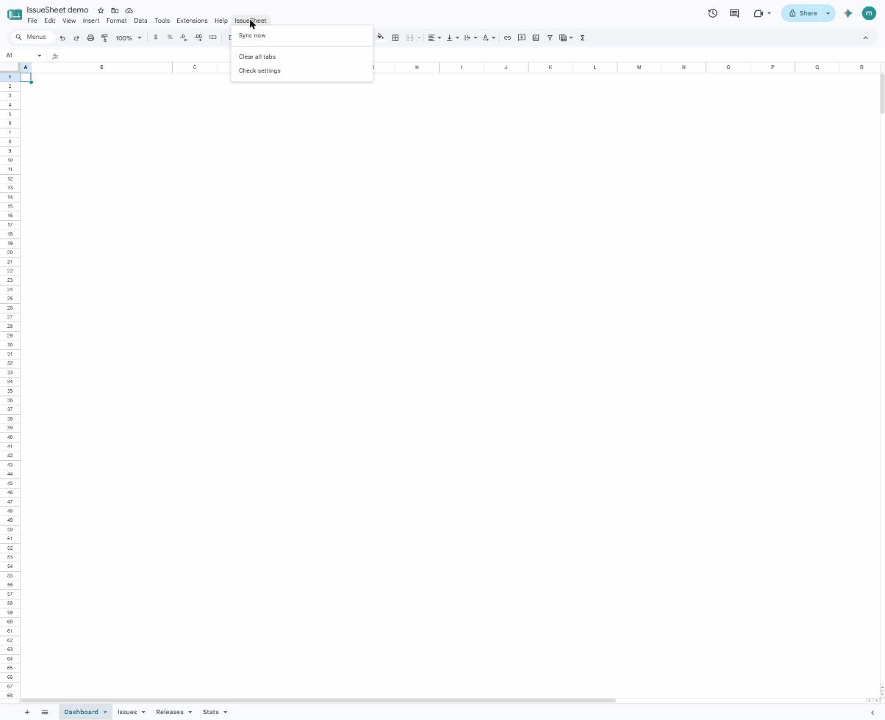

# IssueSheet (free) — Sentry → Google Sheets, on a schedule

A ~150-line Google Apps Script that pulls your **Sentry** issues, releases, and daily error
stats into a Google Sheet **on a schedule** — and builds a little dashboard tab. No backend, no
signup, runs on Google's servers. **Works on every Sentry plan, including the free Developer plan.**

> Sentry's built-in CSV export lives in Discover, which is a **Business-plan feature (~$80/mo)** —
> and even there you **can't schedule it** (the feature request, getsentry/sentry#86563, was
> closed as *not planned*). But the REST API is on **every** plan with self-serve scoped tokens,
> and Sentry's ToS (§4.7) explicitly permits exporting your own data through it. This script just
> wires that up.

## What you get

- **Issues** tab — title, level, event/user counts, first/last seen, status, a link back to Sentry
- **Releases** tab — versions, dates, commit counts, new-issue counts
- **Stats** tab — daily error volume (30 days)
- **Dashboard** tab — KPI cards + a top-issues table + an errors-per-day chart, rebuilt on every sync
- A **time-driven trigger** so it refreshes every few hours with the tab closed and your laptop off
- Bonus: free/Team plans only keep ~30 days of lookback, so the scheduled pull doubles as cheap
  **retention** — your history outlives Sentry's window.

## Setup (~5 minutes)

1. **Create a Sentry auth token** — *Settings → Account → API → Auth Tokens → Create New Token.*
   Minimal read-only scopes: `event:read` (issues), `project:releases` (releases), `org:read` (stats).
2. **New Google Sheet → Extensions → Apps Script.** Delete the stub, paste [`Code.gs`](Code.gs).
   (Optional: show `appsscript.json` in Project Settings and paste [`appsscript.json`](appsscript.json)
   to keep the OAuth scopes minimal — current-spreadsheet only, no Drive access.)
3. **Project Settings → Script Properties**, add three: `SENTRY_ORG`, `SENTRY_PROJECT` (the lowercase
   slugs from your Sentry URL), and `SENTRY_TOKEN` (from step 1).
4. Reload the sheet → an **IssueSheet** menu appears → **Sync now** (approve the one-time auth).
5. Run `installTrigger` once to refresh every 6 hours automatically. Done.

More than 100 issues? Follow the `Link` response header (`rel="next"; results="true"`) with the
`cursor` param — standard Sentry pagination.

## Token safety

The token lives in *your own* Google account's Script Properties and is sent only from your account
straight to Sentry's API — it never touches anyone's servers. Use read-only scopes (above) so even
worst-case it can't modify anything.

## Want this without the setup?

This is the free DIY version, and it's complete — if it covers your needs, just use it. If you'd
rather have it as a **one-click Google Workspace add-on** (setup sidebar, scheduling UI, multiple
projects, no Apps Script editor), I'm building exactly that — waitlist / founding pre-order at
**https://issuesheet.dev**. Honest disclosure: the add-on is launching soon, not shipped yet; this
script is here regardless.

## License & disclaimer

MIT — do whatever you like with it. *IssueSheet is an independent tool, not affiliated with or
endorsed by Sentry / Functional Software, Inc. "Sentry" is a trademark of Functional Software, Inc.*
